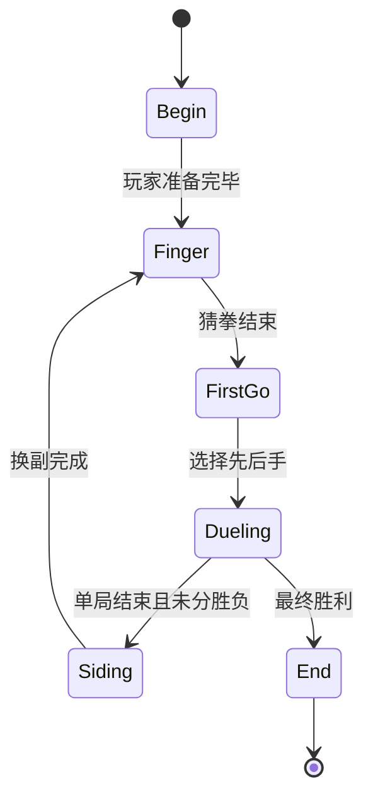

# SRVPro2 插件开发指引

本文档详细介绍如何为 SRVPro2（下一代 YGOPro 服务器）编写外部插件。

---

## 目录

1. [概述](#概述)
2. [项目架构总览](#项目架构总览)
3. [插件加载机制](#插件加载机制)
4. [快速开始：最小插件](#快速开始最小插件)
5. [IoC 容器与依赖注入](#ioc-容器与依赖注入)
6. [中间件系统 (Middleware)](#中间件系统-middleware)
7. [事件系统 (Events)](#事件系统-events)
8. [RxJS 事件流 (event$)](#rxjs-事件流-event)
9. [Room 生命周期与房间事件](#room-生命周期与房间事件)
10. [Client API](#client-api)
11. [使用 declare module 扩展类型](#使用-declare-module-扩展类型)
12. [ValueContainer 模式](#valuecontainer-模式)
13. [配置系统](#配置系统)
14. [i18n 国际化](#i18n-国际化)
15. [TypeORM 实体加载](#typeorm-实体加载)
16. [编码规范与注意事项](#编码规范与注意事项)
17. [完整示例：欢迎消息增强插件](#完整示例欢迎消息增强插件)
18. [完整示例：聊天关键词自动回复插件](#完整示例聊天关键词自动回复插件)
19. [完整示例：对局记录数据库插件](#完整示例对局记录数据库插件)
20. [调试与排错](#调试与排错)
21. [附录：可用服务一览](#附录可用服务一览)
22. [附录：房间事件一览](#附录房间事件一览)
23. [附录：DuelStage 状态机](#附录duelstage-状态机)
24. [附录：常用 YGOPro 消息类型](#附录常用-ygopro-消息类型)

---

## 概述

SRVPro2 是 SRVPro（YGOPro 网络对战服务器）的下一代实现。与上一代「夹在客户端和 ygopro server 之间」的代理模式不同，SRVPro2 **直接通过 WASM 操作 ocgcore**，同时保留了相似的功能框架。

核心技术栈：

| 技术 | 用途 |
|---|---|
| **nfkit** | IoC 容器、事件触发器、中间件调度 |
| **typed-reflector** | 装饰器元数据 |
| **ygopro-msg-encode** | YGOPro 协议编解码 |
| **koishipro-core.js** | OCGCore WASM 绑定 |
| **yuzuthread** | 多线程 Worker |
| **koishi** | 聊天框架（用于 i18n 和 h 函数） |
| **TypeORM** | 数据库 ORM |
| **RxJS** | 响应式事件流 |
| **pino** | 日志 |

SRVPro2 提供了一个 **插件系统**，允许开发者在项目根目录的 `plugins/` 目录下编写 TypeScript 插件，通过 `npm run build` 统一编译后自动加载，而不需要修改核心代码。

---

## 项目架构总览

```
srvpro2/
├── index.ts                  # 入口：import app → app.start()
├── plugins/                  # ★ 插件 TypeScript 源码目录
│   └── my-plugin/
│       └── index.ts
├── src/
│   ├── app.ts                # 应用组装：core（服务） + use（模块）
│   ├── plugin-loader.ts      # 插件加载器
│   ├── config.ts             # 配置定义与加载
│   ├── tail-module.ts        # 最后加载的模块（RoomEventRegister + JoinFallback）
│   ├── client/               # Client 类、传输层、i18n
│   ├── room/                 # Room 类、房间事件、RoomManager
│   ├── feats/                # 功能模块（Welcome、Reconnect、ChatGPT 等）
│   ├── join-handlers/        # JoinGame 消息处理链
│   ├── services/             # 基础服务（Emitter、Logger、Config、TypeORM 等）
│   ├── utility/              # 工具函数、装饰器、元数据
│   ├── constants/            # 常量（i18n 翻译表等）
│   ├── ygopro/               # YGOPro 资源加载
│   └── ...
├── dist/                     # 编译产物（npm run build 输出）
│   ├── plugins/              # ★ 编译后的插件 JS（plugin-loader 从这里加载）
│   └── src/
└── config.yaml               # 运行时配置
```

### 启动顺序

`app.ts` 中的组装顺序决定了模块加载顺序：

```typescript
const core = createAppContext()
  .provide(ConfigService, { merge: ['config'] })
  .provide(Logger, { merge: ['createLogger'] })
  .provide(Emitter, { merge: ['dispatch', 'middleware', 'removeMiddleware'] })
  .provide(MiddlewareRx, { merge: ['event$'] })
  // ... 其他基础服务
  .define();

export const app = core
  .use(TransportModule)       // 1. 客户端传输层
  .use(RoomModule)            // 2. 房间核心
  .use(FeatsModule)           // 3. 功能模块（约 24 个）
  .use(LegacyApiModule)       // 4. 兼容 API
  .use(PreJoinModule)         // 5. 加入前检查
  .use(PluginLoader())        // 6. ★ 插件加载（在此处注入）
  .use(JoinHandlerModule)     // 7. 加入处理链
  .use(TailModule)            // 8. 尾部模块（RoomEventRegister）
  .define();
```

> **关键**：插件在 `FeatsModule` 之后、`JoinHandlerModule` 和 `TailModule` 之前加载。这意味着插件注册的中间件会在 join-handler 链和 `@RoomMethod` 自动注册之前就位。

---

## 插件加载机制

### 开发期（TypeScript 源码）

插件以 **TypeScript** 编写，放置在项目根目录的 `plugins/` 下。`tsconfig.json` 已包含 `"plugins/**/*.ts"` 在编译范围内，因此运行 `npm run build` 时，插件会与主项目一起被 tsc 编译，输出到 `dist/plugins/`。

### 运行期（编译后 JS）

插件加载器的源码位于 `src/plugin-loader.ts`，编译后为 `dist/src/plugin-loader.js`。运行时只有编译产物参与，加载器通过**相对自身位置**的 `../plugins` 找到同级的 `plugins/` 目录（即 `dist/plugins/`）。因此部署时只需要 `dist/` 目录即可。

工作流程：

1. **扫描目录**：递归扫描同级 `plugins/` 目录（即 `dist/plugins/`）下的所有 `.js` 和 `.cjs` 文件
2. **加载模块**：使用 `require()` 加载每个文件
3. **发现插件类**：遍历所有导出项（包括 `default` 和命名导出），检查是否带有 `@DefinePlugin` 装饰器
4. **注册到容器**：调用 `ctx.provide(PluginClass)` 将插件注册到 IoC 容器
5. **去重**：同名插件只加载第一个

```typescript
// 插件加载器的核心逻辑（简化）
for (const pluginFile of pluginFiles) {
  const loadedModule = require(pluginFile);
  for (const item of resolveExportedItems(loadedModule)) {
    const pluginName = reflector.get('plugin', item);   // 读取 @DefinePlugin 元数据
    if (pluginName && !loadedPluginNames.has(pluginName)) {
      ctx.provide(item);                                 // 注册到 IoC 容器
      loadedPluginNames.add(pluginName);
    }
  }
}
```

### 文件要求

- 插件源码以 `.ts` 编写，放置在 `plugins/` 目录下，支持任意深度的子目录
- 运行 `npm run build` 后，tsc 将源码编译到 `dist/plugins/` 目录（`.js`）
- 导出的类必须带有 `@DefinePlugin()` 装饰器

---

## 快速开始：最小插件

### 步骤 1：创建插件源码

在项目根目录的 `plugins/` 下创建 TypeScript 文件。由于插件和主项目共享同一个 `tsconfig.json`，因此 **import 使用相对路径**：

```typescript
// plugins/my-plugin/index.ts
import { DefinePlugin, BasePlugin } from '../../src/utility/base-plugin';

@DefinePlugin('my-plugin')
export class MyPlugin extends BasePlugin {
  private logger = this.ctx.createLogger('MyPlugin');

  async init() {
    this.logger.info('MyPlugin loaded!');
  }
}
```

### 步骤 2：编译

在项目根目录运行标准构建命令即可，tsc 会同时编译主项目和所有插件：

```bash
npm run build
```

编译后的文件结构：

```
dist/
├── src/                      # 主项目编译产物
│   └── ...
└── plugins/                  # 插件编译产物
    └── my-plugin/
        └── index.js          ← plugin-loader 从这里加载
```

### 步骤 3：启动服务器

正常启动 SRVPro2，控制台会看到：

```
[PluginLoader] Loaded plugin provider { pluginFile: '...', plugin: 'my-plugin' }
```

### 步骤 4：部署

| 部署方式 | 方法 |
|---|---|
| 直接部署 | 将整个 `dist/` 复制到目标服务器 |
| Docker | 将编译好的插件 JS 通过 volume 挂载到容器内的 `dist/plugins/` 路径 |

```yaml
# docker-compose.yml 示例
volumes:
  - ./my-plugins-dist:/usr/src/app/dist/plugins
```

### 关键点

- `@DefinePlugin(name)` 装饰器为必需，它标记一个类是插件并设置唯一名称
- `BasePlugin` 提供 `protected ctx: Context` 属性，即 IoC 上下文
- `async init()` 方法在 IoC 容器解析依赖后自动调用（由 nfkit 保证**仅调用一次**），**不需要**手动加防重入保护
- **禁止在 `constructor` 中注册中间件**，必须在 `init()` 中注册
- import 使用**相对路径**引用主项目代码（如 `'../../src/room'`）

---

## IoC 容器与依赖注入

SRVPro2 使用 nfkit 的 `AppContext` 作为 IoC 容器。`Context` 类型在 `src/app.ts` 中定义：

```typescript
export type Context = typeof core;
export type ContextState = AppContextState<Context>;
```

### 获取服务实例

在插件中，通过 `this.ctx.get()` 获取已注册的服务：

```typescript
import { RoomManager } from '../../src/room';

@DefinePlugin('my-plugin')
export class MyPlugin extends BasePlugin {
  // 惰性获取（推荐用于字段初始化）
  private roomManager = this.ctx.get(() => RoomManager);

  async init() {
    const rooms = this.roomManager.allRooms();
  }
}
```

### 上下文中可用的合并方法

`app.ts` 中通过 `{ merge: [...] }` 将服务方法合并到 Context 上，插件中可直接通过 `this.ctx` 调用：

| 方法 | 来源 | 说明 |
|---|---|---|
| `this.ctx.config` | `ConfigService` | 配置对象，见[配置系统](#配置系统) |
| `this.ctx.createLogger(name)` | `Logger` | 创建 pino 子日志器 |
| `this.ctx.dispatch(msg, client)` | `Emitter` | 派发消息/事件到中间件链 |
| `this.ctx.middleware(cls, handler, prior?)` | `Emitter` | 注册中间件 |
| `this.ctx.removeMiddleware(cls, handler)` | `Emitter` | 移除中间件 |
| `this.ctx.event$(cls, prior?)` | `MiddlewareRx` | 获取事件的 RxJS Observable |
| `this.ctx.http` | `HttpClient` | Axios HTTP 客户端 |
| `this.ctx.aragami` | `AragamiService` | Aragami 实例 |
| `this.ctx.router` | `KoaService` | Koa Router（HTTP API） |
| `this.ctx.koa` | `KoaService` | Koa 应用实例 |
| `this.ctx.SQL` | `SqljsLoader` | SQL.js 实例 |
| `this.ctx.database` | `TypeormLoader` | TypeORM DataSource |

---

## 中间件系统 (Middleware)

中间件是 SRVPro2 中最核心的扩展机制。`Emitter`（基于 nfkit 的 `ProtoMiddlewareDispatcher`）通过**消息类型（class）**来组织中间件链。

### 注册中间件

```typescript
this.ctx.middleware(MessageClass, async (msg, client, next) => {
  // msg: MessageClass 的实例
  // client: 触发此消息的 Client
  // next: 调用下一个中间件

  // 处理逻辑...
  return next();     // ← 必须调用 next() 传递给后续中间件
});
```

### 中间件的三种行为

```typescript
// 1. 传递（pass-through）：处理后继续
this.ctx.middleware(SomeMsg, async (msg, client, next) => {
  doSomething();
  return next();   // 继续链条
});

// 2. 拦截（intercept）：阻止后续中间件执行
this.ctx.middleware(SomeMsg, async (msg, client, next) => {
  if (shouldBlock) {
    return;          // 不调用 next()，消息被吞掉
  }
  return next();
});

// 3. 修改（mutate）：修改消息内容后继续
this.ctx.middleware(SomeMsg, async (msg, client, next) => {
  msg.someField = newValue;
  return next();
});
```

> **规范**：如果你的中间件不是用于拦截消息，**必须** `return next()`。

### 中间件作用于两大类消息

| 消息方向 | 类型基类 | 说明 | 示例 |
|---|---|---|---|
| 客户端 → 服务端 (CTOS) | `YGOProCtosBase` | 客户端发送的操作 | `YGOProCtosChat`、`YGOProCtosJoinGame` |
| 服务端 → 客户端 (STOC) | `YGOProStocBase` | 服务端发给客户端的消息 | `YGOProStocReplay`、`YGOProStocChat` |
| 房间事件 | `RoomEvent` | 房间生命周期事件 | `OnRoomJoin`、`OnRoomWin` |
| 游戏消息 (MSG) | `YGOProMsgBase` | OCGCore 游戏消息 | `YGOProMsgWin`、`YGOProMsgDamage` |

### 优先中间件

通过第三个参数 `prior = true` 可以将中间件插入到链的最前面：

```typescript
this.ctx.middleware(SomeMsg, handler, true);  // 优先执行
```

---

## 事件系统 (Events)

`dispatch` 用于主动触发事件。事件也经过中间件链处理。

### 派发事件

```typescript
// 派发房间事件
await this.ctx.dispatch(new OnRoomCreate(room), client);

// 派发自定义事件（基于 ValueContainer 模式）
const event = await this.ctx.dispatch(new MyCustomEvent(data), client);
// event 可能为 undefined（如果被某个中间件拦截）
```

### 监听事件

```typescript
// 通过中间件监听事件
this.ctx.middleware(OnRoomJoin, async (event, client, next) => {
  const room = event.room;
  // 处理逻辑...
  return next();
});
```

---

## RxJS 事件流 (event$)

`MiddlewareRx` 提供了将中间件事件转换为 RxJS Observable 的能力，适合构建复杂的响应式逻辑：

```typescript
import { filter, share } from 'rxjs/operators';

@DefinePlugin('my-plugin')
export class MyPlugin extends BasePlugin {
  // 创建事件流
  private onJoin$ = this.ctx.event$(OnRoomJoin).pipe(share());
  private onWin$ = this.ctx.event$(OnRoomWin).pipe(share());

  constructor(ctx: Context) {
    super(ctx);

    // 订阅事件流
    this.onJoin$.subscribe(({ msg, client }) => {
      const room = msg.room;
      // msg 是事件实例，client 是触发的客户端
    });

    // 带过滤的事件流
    this.onWin$.pipe(
      filter(({ msg }) => msg.winMatch),  // 仅在赢得整场比赛时触发
    ).subscribe(({ msg, client }) => {
      // ...
    });
  }
}
```

> **注意**：`event$` 内部使用中间件实现，会自动调用 `next()`，因此**不会阻止**其他中间件的执行。

---

## Room 生命周期与房间事件

### DuelStage 状态机

房间的 `duelStage` 属性表示当前阶段：

```
Begin → Finger → FirstGo → Dueling → Siding → (回到 Finger)
                                   ↘ End（最终胜利 → finalize）
```

| 阶段 | 说明 |
|---|---|
| `Begin` | 等待玩家加入和准备 |
| `Finger` | 猜拳（SelectHand） |
| `FirstGo` | 先后手选择（SelectTp） |
| `Dueling` | 决斗进行中 |
| `Siding` | 换副阶段（更换副卡组） |
| `End` | 决斗结束 |

### Room 核心属性

```typescript
room.name               // 房间名称（即房间密码）
room.identifier          // 64 位随机唯一标识符
room.hostinfo            // HostInfo 结构体（规则、LP、时间限制等）
room.duelStage           // 当前阶段
room.players             // Client[] | undefined[]，长度 2（普通）或 4（TAG）
room.watchers            // Set<Client>，观战者集合
room.playingPlayers      // 过滤掉 undefined 的玩家数组
room.allPlayers          // 玩家 + 观战者
room.score               // [number, number] 比分
room.duelRecords         // DuelRecord[] 对局记录
room.isTag               // 是否 TAG 模式
room.finalizing          // 是否正在结束
room.createTime          // 创建时间
room.noHost              // 是否无房主（如 AI 房）
```

### Room 核心方法

```typescript
room.join(client, toObserver?)     // 玩家加入房间
room.removePlayer(client, bySystem?)  // 移除玩家
room.finalize(sendReplays?)        // 销毁房间
room.sendChat(msg, color)          // 向房间所有人发消息
room.addFinalizor(fn, atEnd?)      // 添加销毁回调
room.getDuelPos(clientOrPos)       // 获取决斗位置（0 或 1）
room.getTeammates(clientOrPos)     // 获取队友
room.getOpponents(clientOrPos)     // 获取对手
room.getCurrentFieldInfo()         // 获取场上信息（LP、卡数等）
```

### 通过 RoomManager 访问房间

```typescript
import { RoomManager } from '../../src/room';

const roomManager = this.ctx.get(() => RoomManager);

// 按名称查找
const room = roomManager.findByName(roomName);

// 获取所有房间
const rooms = roomManager.allRooms();

// 查找或创建房间
const room = await roomManager.findOrCreateByName(name, hostinfo?);
```

### 房间事件完整列表

所有房间事件都继承自 `RoomEvent`，包含 `room: Room` 属性。从 `src/room/index.ts` 导出。

| 事件类 | 触发时机 | 附加数据 |
|---|---|---|
| `OnRoomCreate` | 房间创建后 | — |
| `OnRoomJoin` | 任何人加入房间后 | — |
| `OnRoomJoinPlayer` | 玩家加入后 | — |
| `OnRoomJoinObserver` | 观战者加入后 | — |
| `OnRoomLeave` | 任何人离开房间后 | — |
| `OnRoomLeavePlayer` | 玩家离开后 | `oldPos`, `reason`, `bySystem` |
| `OnRoomLeaveObserver` | 观战者离开后 | `reason`, `bySystem` |
| `OnRoomFinger` | 猜拳时 | `fingerPlayers: [Client, Client]` |
| `OnRoomSelectTp` | 选择先后手时 | `selector: Client` |
| `OnRoomDuelStart` | 单局决斗开始 | — |
| `OnRoomGameStart` | 对局开始（含 TAG 组队） | — |
| `OnRoomMatchStart` | 比赛开始 | — |
| `OnRoomSidingStart` | 换副开始 | — |
| `OnRoomSidingReady` | 换副完成 | — |
| `OnRoomWin` | 单局胜负判定后 | `winMsg`, `winMatch`, `wasSwapped` |
| `OnRoomFinalize` | 房间即将销毁 | — |
| `RoomCheckDeck` | 检查卡组合法性 | `client`, `deck`, `cardReader`（`ValueContainer`） |

---

## Client API

`Client` 表示一个连接到服务器的客户端。

### 核心属性

```typescript
client.name              // 玩家名称
client.ip                // IP 地址
client.pos               // 座位号（0~3 为玩家，NetPlayerType.OBSERVER 为观战者）
client.roomName          // 当前所在房间名
client.roompass          // 加入时使用的密码
client.isHost            // 是否为房主
client.deck              // YGOProDeck | undefined（当前卡组）
client.startDeck         // YGOProDeck | undefined（开始时卡组）
client.disconnected      // Date | undefined（断线时间）
client.established       // 是否已完成握手
client.hostname          // 主机名
client.isLocal           // 是否本地连接
client.isInternal        // 是否内部连接（如 windbot）
```

### 核心方法

```typescript
// 发送 STOC 消息给客户端
await client.send(stocMessage);

// 发送聊天消息
await client.sendChat('Hello!', ChatColor.BABYBLUE);
await client.sendChat('#{i18n_key}', ChatColor.RED);    // 使用 i18n

// 断开连接
client.disconnect();

// 发送错误消息后断开
await client.die('错误原因', ChatColor.RED);

// 获取 locale
const locale = client.getLocale();  // 如 'zh-CN' 或 'en-US'
```

### ChatColor 枚举

```typescript
import { ChatColor } from 'ygopro-msg-encode';

ChatColor.RED         // 红色
ChatColor.GREEN       // 绿色
ChatColor.BABYBLUE    // 浅蓝（默认）
ChatColor.PINK        // 粉色
ChatColor.LIGHTBLUE   // 亮蓝
ChatColor.YELLOW      // 黄色
```

### RxJS 流

```typescript
client.receive$       // Observable<YGOProCtosBase> 接收消息流
client.disconnect$    // Observable<{ bySystem: boolean }> 断线事件
```

---

## 使用 declare module 扩展类型

SRVPro2 约定使用 TypeScript 的 `declare module` 来为 `Room` 和 `Client` 添加新属性，**禁止**直接修改它们的类定义。

### 扩展 Room

```typescript
// 在你的插件文件顶部
declare module '../../src/room' {
  interface Room {
    myCustomField?: string;
    myCustomCounter: number;
  }
}
```

> 运行时直接赋值即可，TypeScript 的 `declare module` 仅做类型合并。

### 扩展 Client

```typescript
declare module '../../src/client' {
  interface Client {
    myPluginData?: MyDataType;
  }
}
```

### 实际使用示例（来自内置模块）

```typescript
// src/feats/welcome.ts
declare module '../room' {
  interface Room {
    welcome: string;
    welcome2: string;
  }
}

declare module '../client' {
  interface Client {
    configWelcomeSent?: boolean;
  }
}
```

---

## ValueContainer 模式

`ValueContainer<T>` 是一个简单的值持有者，用于需要通过 `dispatch` 让中间件链修改值的场景：

```typescript
// src/utility/value-container.ts
export class ValueContainer<T> {
  constructor(public value: T) {}
  use(value: T) {
    this.value = value;
    return this;
  }
}
```

### 使用场景

当你希望其他中间件能修改某个值时：

```typescript
// 定义一个可修改的事件
export class MyConfigEvent extends ValueContainer<string> {
  constructor(public client: Client, initialValue: string) {
    super(initialValue);
  }
}

// 派发事件，让中间件有机会修改
const event = await this.ctx.dispatch(
  new MyConfigEvent(client, 'default-value'),
  client,
);
const finalValue = event?.value || 'fallback';

// 插件可以通过 middleware 修改这个值
this.ctx.middleware(MyConfigEvent, async (event, client, next) => {
  event.value = 'modified-by-plugin';
  return next();
});
```

内置用例：`WelcomeConfigCheck`（修改欢迎消息）、`RoomCheckDeck`（修改卡组检查结果）。

---

## 配置系统

配置通过 `config.yaml` 加载，所有配置项**必须是字符串**类型。

### 读取配置

```typescript
const value = this.ctx.config.getString('MY_KEY');        // 原始字符串
const num = this.ctx.config.getInt('MY_PORT');             // 整数
const bool = this.ctx.config.getBoolean('ENABLE_FEATURE'); // 布尔值
```

### 布尔值解析规则

- **默认 false**：`''`、`'0'`、`'false'`、`'null'` → `false`，其他 → `true`
- **默认 true**（仅部分配置项使用）：只有 `'0'`、`'false'`、`'null'` → `false`

### 添加自定义配置

推荐在 `config.yaml` 中添加自定义字段（它们不会影响核心功能），然后通过 `this.ctx.config.getString()` 读取：

```typescript
@DefinePlugin('my-plugin')
export class MyPlugin extends BasePlugin {
  // 从 config.yaml 读取自定义字段
  private enabled = this.ctx.config.getString('MY_PLUGIN_ENABLED') === '1';

  // 也可以从环境变量读取
  private myConfigValue = process.env.MY_PLUGIN_VALUE || 'default';
}
```

---

## i18n 国际化

SRVPro2 使用 Koishi 的 i18n 系统。聊天消息中以 `#{}` 包裹的字符串会被自动翻译。

### 使用方法

```typescript
// 在 sendChat 中使用 i18n key
await client.sendChat('#{welcome_message}', ChatColor.GREEN);

// 拼接
await client.sendChat(
  `#{side_timeout_part1}${minutes}#{side_timeout_part2}`,
  ChatColor.BABYBLUE,
);
```

### 翻译表

翻译表定义在 `src/constants/trans.ts` 中，是一个 `{ locale: { key: value } }` 格式的对象，支持 `zh-CN`、`en-US` 等 locale。

### 在插件中添加翻译

如果你需要添加新的 i18n 字符串，可以通过 `I18nService` 注册：

```typescript
import { I18nService } from '../../src/client';

@DefinePlugin('my-plugin')
export class MyPlugin extends BasePlugin {
  async init() {
    const i18n = this.ctx.get(() => I18nService);
    // 注册翻译（使用 nfkit I18n 的 middleware 机制）
    // 具体方式取决于 I18n 类的 API
  }
}
```

---

## TypeORM 实体加载

SRVPro2 支持从 `plugins/` 目录自动加载 TypeORM 实体。

### 约定

- 实体源文件必须以 **`.entity.ts`** 结尾（编译后为 `.entity.js`）
- 文件放置在 `plugins/` 下任意位置
- 加载器（`plugin-typeorm-entity-loader.ts`）在 TypeORM DataSource 初始化时扫描 `dist/plugins/` 中的 `.entity.js` 文件
- 实体类必须使用 TypeORM 的 `@Entity()` 装饰器

### 示例

```typescript
// plugins/my-plugin/my-record.entity.ts
import { Entity, PrimaryGeneratedColumn, Column, CreateDateColumn } from 'typeorm';
import { BaseTimeEntity } from '../../src/utility/base-time.entity';

@Entity('my_plugin_records')
export class MyRecord extends BaseTimeEntity {
  @PrimaryGeneratedColumn()
  id: number;

  @Column()
  playerName: string;

  @Column()
  score: number;
}
```

`npm run build` 编译后产出 `dist/plugins/my-plugin/my-record.entity.js`，会被自动扫描并注册到 TypeORM。

### 在插件中使用数据库

```typescript
@DefinePlugin('my-plugin')
export class MyPlugin extends BasePlugin {
  async init() {
    const repo = this.ctx.database.getRepository(MyRecord);
    const records = await repo.find({ where: { playerName: 'test' } });
  }
}
```

> **规范**：删除操作一律使用 `softDelete`。

---

## 编码规范与注意事项

### 必须遵守

1. **禁止保存 Client/Room 的强引用**（包括 Map key/value、闭包长期持有）。使用 `pos`、`room.name` 等轻量标识代替
2. **禁止在 constructor 中注册中间件**。在 `async init()` 中注册
3. **中间件不拦截消息时必须 `return next()`**
4. **禁止直接在 Client/Room 类中添加字段**。使用 `declare module` 扩展类型
5. **纯算法/工具函数不放在类方法里**。在 `utility/` 目录新建文件

### 建议

- `init()` **不需要加重复调用护栏**，nfkit 保证只调用 1 次
- 尽量定义新的模块实现功能，而不是修改已有方法
- 使用 `this.ctx.createLogger('ModuleName')` 创建日志器
- Room 事件不应依赖 `YGOProMsgStart` 或 `YGOProMsgWin` 等直接消息事件（经常不准），应依赖 Room 专用事件

### 引用规范

- 同目录文件使用 `'./xxx'`
- 子目录使用 `'../xxx'`
- 核心模块通过 index.ts 引用：`'../room'`、`'../client'`
- **禁止**直接引用具体文件如 `'../room/room'`

---

## 完整示例：欢迎消息增强插件

这是一个在玩家加入房间时发送自定义欢迎消息的插件。

```typescript
// plugins/enhanced-welcome/index.ts
import { DefinePlugin, BasePlugin } from '../../src/utility/base-plugin';
import { OnRoomJoin } from '../../src/room';
import { ChatColor } from 'ygopro-msg-encode';
import type { Context } from '../../src/app';

@DefinePlugin('enhanced-welcome')
export class EnhancedWelcome extends BasePlugin {
  private logger = this.ctx.createLogger('EnhancedWelcome');
  private welcomeMessage = process.env.ENHANCED_WELCOME_MSG || 'Welcome to our server!';

  async init() {
    this.logger.info('Enhanced welcome plugin initialized');

    this.ctx.middleware(OnRoomJoin, async (event, client, next) => {
      const room = event.room;
      const playerCount = room.allPlayers.length;

      await client.sendChat(
        `${this.welcomeMessage} (${playerCount} players online)`,
        ChatColor.GREEN,
      );

      return next();
    });
  }
}
```

---

## 完整示例：聊天关键词自动回复插件

这是一个监听玩家聊天消息，并在特定关键词时自动回复的插件。

```typescript
// plugins/chat-reply/index.ts
import { DefinePlugin, BasePlugin } from '../../src/utility/base-plugin';
import { YGOProCtosChat, ChatColor } from 'ygopro-msg-encode';
import { RoomManager } from '../../src/room';

@DefinePlugin('chat-reply')
export class ChatReply extends BasePlugin {
  private logger = this.ctx.createLogger('ChatReply');
  private roomManager = this.ctx.get(() => RoomManager);

  private replies: Record<string, string> = {
    'help': '可用命令: help, rules, score',
    'rules': '标准规则，禁卡表已加载。',
  };

  async init() {
    this.logger.info('Chat reply plugin initialized');

    this.ctx.middleware(YGOProCtosChat, async (msg, client, next) => {
      const content = (msg.msg || '').trim().toLowerCase();

      // 检查是否匹配关键词
      const reply = this.replies[content];
      if (reply) {
        // 注意：不要保存 client 的强引用
        await client.sendChat(reply, ChatColor.PINK);
        // 不 return，继续传递消息
      }

      return next();
    });
  }
}
```

---

## 完整示例：对局记录数据库插件

这是一个使用 TypeORM 将对局结果存入数据库的插件。

```typescript
// plugins/match-logger/match-log.entity.ts
import { Entity, PrimaryGeneratedColumn, Column, CreateDateColumn } from 'typeorm';

@Entity('match_logs')
export class MatchLog {
  @PrimaryGeneratedColumn()
  id: number;

  @Column()
  roomName: string;

  @Column()
  winner: string;

  @Column()
  loser: string;

  @Column()
  score: string;

  @CreateDateColumn()
  createdAt: Date;
}
```

```typescript
// plugins/match-logger/index.ts
import { DefinePlugin, BasePlugin } from '../../src/utility/base-plugin';
import { OnRoomWin } from '../../src/room';
import { MatchLog } from './match-log.entity';
import { share, filter } from 'rxjs/operators';

@DefinePlugin('match-logger')
export class MatchLogger extends BasePlugin {
  private logger = this.ctx.createLogger('MatchLogger');
  private onWin$ = this.ctx.event$(OnRoomWin).pipe(share());

  async init() {
    this.logger.info('Match logger plugin initialized');

    this.onWin$.pipe(
      filter(({ msg }) => msg.winMatch),  // 仅在赢得整场比赛时记录
    ).subscribe(({ msg }) => {
      void this.logMatch(msg).catch((error) => {
        this.logger.warn({ error }, 'Failed to log match');
      });
    });
  }

  private async logMatch(event: OnRoomWin) {
    const room = event.room;
    const winDuelPos = event.winMsg.player;
    const winPlayers = room.getDuelPosPlayers(winDuelPos)
      .map(p => p.name).join(' & ');
    const losePlayers = room.getDuelPosPlayers(1 - winDuelPos)
      .map(p => p.name).join(' & ');

    const repo = this.ctx.database.getRepository(MatchLog);
    await repo.save({
      roomName: room.name,
      winner: winPlayers,
      loser: losePlayers,
      score: room.score.join('-'),
    });

    this.logger.info(
      { room: room.name, winner: winPlayers, score: room.score.join('-') },
      'Match result logged',
    );
  }
}
```

> 注意：`match-log.entity.ts` 经 `npm run build` 编译后产出 `dist/plugins/match-logger/match-log.entity.js`，会被自动扫描并注册到 TypeORM。

---

## 调试与排错

### 日志

使用 `this.ctx.createLogger('Name')` 创建的日志器支持 pino 日志级别：

```typescript
const logger = this.ctx.createLogger('MyPlugin');
logger.debug({ data }, 'Debug message');
logger.info('Info message');
logger.warn({ error }, 'Warning');
logger.error({ error }, 'Error');
```

通过配置 `LOG_LEVEL: 'debug'` 可以输出 debug 级别日志。

### 插件加载失败

如果插件加载失败，`PluginLoader` 会输出 warn 级别日志并跳过该文件：

```
[PluginLoader] Failed requiring plugin file { pluginFile: '...', error: '...' }
```

常见原因：
- 编译错误导致 JS 文件未生成（检查 `npm run build` 输出）
- 缺少依赖
- 运行时错误

### 插件名重复

同名插件只有第一个会被加载，后续的会被跳过并输出警告：

```
[PluginLoader] Skipped duplicate plugin name { ... }
```

### 中间件未生效

检查：
1. 是否在 `init()` 中注册（不是 `constructor`）
2. 消息类型是否正确（注意区分 CTOS/STOC/MSG/Event）
3. 是否有 `return next()` 或 `return`
4. 检查中间件注册顺序（插件在 FeatsModule 之后加载）

---

## 附录：可用服务一览

| 服务类 | 获取方式 | 说明 |
|---|---|---|
| `ConfigService` | `this.ctx.config` | 配置读取 |
| `Logger` | `this.ctx.createLogger(name)` | 日志 |
| `Emitter` | `this.ctx.middleware/dispatch` | 中间件系统 |
| `MiddlewareRx` | `this.ctx.event$(cls)` | RxJS 事件流 |
| `HttpClient` | `this.ctx.http` | HTTP 请求 |
| `RoomManager` | `this.ctx.get(() => RoomManager)` | 房间管理器 |
| `KoaService` | `this.ctx.router / this.ctx.koa` | HTTP API |
| `TypeormLoader` | `this.ctx.database` | 数据库 |
| `SqljsLoader` | `this.ctx.SQL` | SQL.js |
| `I18nService` | `this.ctx.get(() => I18nService)` | 国际化 |
| `FileResourceService` | `this.ctx.get(() => FileResourceService)` | 文件资源 |
| `YGOProResourceLoader` | `this.ctx.get(() => YGOProResourceLoader)` | YGOPro 资源（卡片数据库、脚本等） |

---

## 附录：房间事件一览

```
OnRoomCreate          房间创建
  │
  ├── OnRoomJoin              任何人加入（通用）
  │     ├── OnRoomJoinPlayer    玩家加入
  │     └── OnRoomJoinObserver  观战者加入
  │
  ├── OnRoomFinger            猜拳
  ├── OnRoomSelectTp          先后手选择
  ├── OnRoomMatchStart        比赛开始
  ├── OnRoomGameStart         对局开始
  ├── OnRoomDuelStart         单局开始
  │
  ├── OnRoomWin               单局胜负判定
  │
  ├── OnRoomSidingStart       换副开始
  ├── OnRoomSidingReady       换副完成
  │
  ├── OnRoomLeave             任何人离开（通用）
  │     ├── OnRoomLeavePlayer   玩家离开
  │     └── OnRoomLeaveObserver 观战者离开
  │
  ├── RoomCheckDeck           卡组合法性检查 (ValueContainer)
  │
  └── OnRoomFinalize          房间即将销毁
```

---

## 附录：DuelStage 状态机



---

## 附录：常用 YGOPro 消息类型

### CTOS（客户端 → 服务端）

| 类名 | 说明 |
|---|---|
| `YGOProCtosJoinGame` | 加入房间（含 pass） |
| `YGOProCtosChat` | 发送聊天消息（含 `msg` 字段） |
| `YGOProCtosUpdateDeck` | 提交/更新卡组 |
| `YGOProCtosHsStart` | 房主点击开始 |
| `YGOProCtosHsReady` | 玩家准备好 |
| `YGOProCtosHsNotReady` | 取消准备 |
| `YGOProCtosHsToObserver` | 切换为观战者 |
| `YGOProCtosHsToDuelist` | 切换为决斗者 |
| `YGOProCtosKick` | 踢人 |
| `YGOProCtosResponse` | 对 OCGCore 的操作响应 |
| `YGOProCtosSurrender` | 投降 |
| `YGOProCtosTpResult` | 先后手选择结果 |
| `YGOProCtosHandResult` | 猜拳结果 |
| `YGOProCtosTimeConfirm` | 时间确认 |

### STOC（服务端 → 客户端）

| 类名 | 说明 |
|---|---|
| `YGOProStocJoinGame` | 加入房间确认 |
| `YGOProStocChat` | 聊天消息 |
| `YGOProStocDuelStart` | 决斗开始 |
| `YGOProStocDuelEnd` | 决斗结束 |
| `YGOProStocReplay` | 发送回放 |
| `YGOProStocGameMsg` | 游戏消息包装 |
| `YGOProStocTypeChange` | 角色类型变更 |
| `YGOProStocHsPlayerEnter` | 玩家进入通知 |
| `YGOProStocHsPlayerChange` | 玩家状态变更 |
| `YGOProStocHsWatchChange` | 观战者数量变更 |
| `YGOProStocErrorMsg` | 错误消息 |
| `YGOProStocSelectTp` | 先后手选择提示 |
| `YGOProStocSelectHand` | 猜拳提示 |
| `YGOProStocChangeSide` | 换副提示 |
| `YGOProStocDeckCount` | 卡组数量信息 |

### MSG（OCGCore 游戏消息）

| 类名 | 说明 |
|---|---|
| `YGOProMsgStart` | 游戏开始（LP、卡组数等） |
| `YGOProMsgWin` | 胜负判定 |
| `YGOProMsgNewTurn` | 新回合 |
| `YGOProMsgNewPhase` | 新阶段 |
| `YGOProMsgDamage` | 伤害 |
| `YGOProMsgPayLpCost` | 支付 LP |
| `YGOProMsgUpdateData` | 更新区域数据 |
| `YGOProMsgUpdateCard` | 更新单卡数据 |
| `YGOProMsgRetry` | 操作重试 |
| `YGOProMsgMatchKill` | 赛制击杀 |

---

*本文档基于 SRVPro2 源码分析生成。如有疑问请参考 `src/` 目录下的源代码。*
